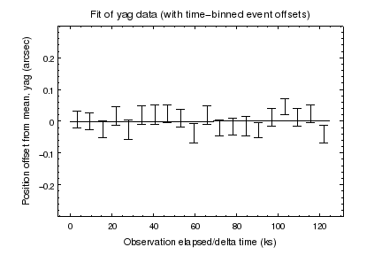
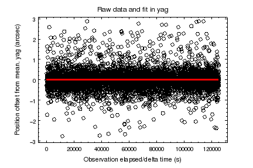
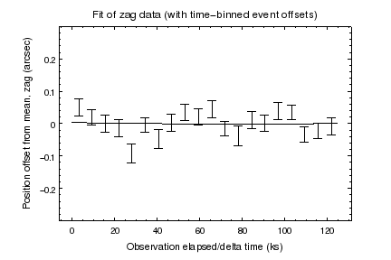
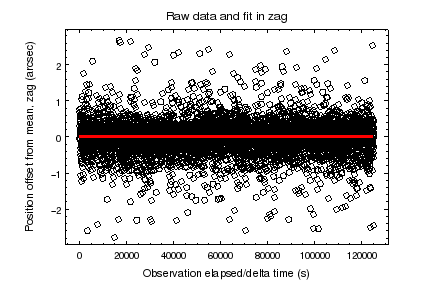

# Correct Events for Aspect Periscope Drift

## Introduction and History

Thermal cycling on the spacecraft can result in an apparent temporal drift of the sky
position of an X-ray source during an observation.  This appears as a drift of up to about
0.5 arcsec in X-ray event sky X, Y coordinates over time.  Because of the thermal
variation time scales, this effect is usually most prominent in long observations (more
than about 50 ksec).

As of DS 8.4, a drift correction is applied to the aspect solution using the periscope
gradients telemetry.  However, temporal drifts have continued to increase with thermal
variation of the spacecraft.  Therefore the Aspect team suggests that to accomplish
science related to sub-arcsec source structure, users should follow this thread to correct
residual drift induced by the periscope.  This requires a relatively bright, on-axis source (within
a few arcmin off-axis angle) to perform a "self-calibration" of the aspect solution.

## Overview of determining a correction

To aid in determining the drift during an observation, we provide a script which takes as input:

 * Chandra evt1 or evt2 file
 * Chandra aspect solution
 * Coordinates and radius of a bright, point-like X-ray source
 * Degree of the desired fit polynomial

This script returns:

 * Plots of the fits of the drift in Aspect Camera Y and Z angle
 * New aspect solution file with offsets updated to include drift corrections

Users of the script may use the plots to evaluate the goodness of fit to their data and to
determine if applying the correction will have value.

## Applying a correction

This new aspect solution may be applied via the chandra_repro (via acis_process_events or
hrc_process_events) procedure to correct the sky positions in a new evt2 file.  See

http://cxc.harvard.edu/ciao/threads/createL2/

and

http://cxc.harvard.edu/ciao/ahelp/chandra_repro.html

## Note on coordinate systems

The correction is performed by directly updating the dy and dz values in the aspect
solution.  The dy/dz values are aligned with the Aspect Camera Y and Z axes, and
therefore, to fit the X-ray events, this tool transforms the event coordinates into
positions in the Aspect Camera frame, and then independently fits offsets in those Y and Z
axes.  Note that the positions in this frame are abbreviated 'yag' and 'zag' in the fit and
data plots output by the tool.

## Walkthrough/Example

### Get data

Fetch the data for an observation.

For gratings data, obviously only use events around the zeroth order position.

    download_chandra_obsid 16659

### Select a source

View and select a region to use for the autocorrection. Celldetect is one rough method to view and select a source.

    punlearn celldetect
    celldetect infile=16659/primary/acisf16659N001_evt2.fits.gz outfile=mysrc.fits
    punlearn dmsort
    dmsort mysrc.fits'[SRCLIST]' key=-snr outfile=mysrc_snrsort.fits
    dmlist mysrc_snrsort.fits'[cols net_counts, x, y, snr, r][net_counts > 500]' data | head

    --------------------------------------------------------------------------------
    Data for Table Block SRCLIST
    --------------------------------------------------------------------------------

    ROW NET_COUNTS       POS(X,Y)                                 SNR  R[2]

    1   6187.6665039062 (4557.7041829672, 4545.8621727355)
    72.2447509766 [       10.6039648056         6.1736688614]
    2   3222.8750       (4133.7619994320, 4078.7477989208)
    52.1157989502 [        1.8717634678         1.7822588682]
    3   1616.1666259766 (3451.3598281418, 4158.0214822771)
    34.1368141174 [       11.2211189270         8.3461980820]

We are looking for a high count, high SNR source, relatively close to the optical axis (which for ACIS is
defined at x,y = 4096.5, 4096.5).  The second source will do.  We select a radius larger
than the larger reported value of R of the celldetect shape, and view in ds9.

    ds9 16659/primary/acisf16659N001_evt2.fits.gz \
    -bin about 4133.7619994320 4078.7477989208 \
    -scale log \
    -regions command "circle 4133.7619994320 4078.7477989208 6 # color=red" \
    -zoom 8

The source looks point-like and is contained within the specified region.

### Setup the correction tool using the source for reference events for the correction

    punlearn correct_periscope_drift

Set the source for the tool.

    pset correct_periscope_drift x=4133.7619994320 y=4078.7477989208 radius=6

Set the other input and output files as desired

    pset correct_periscope_drift infile=16659/primary/pcadf537654279N001_asol1.fits.gz
    pset correct_periscope_drift evtfile=16659/primary/acisf16659N001_evt2.fits.gz
    pset correct_periscope_drift outfile=driftcorr_asol1.fits

### Run the tool

    correct_periscope_drift

The tool will write out an updated aspect solution to 'driftcorr_asol1.fits' as requested
by the outfile parameter and will save the plots of the fits into the working directory.

### Run chandra_repro with the new aspect solution.

    # move the original aspect solution out of the primary directory and rename
    mv 16659/primary/pcadf537654279N001_asol1.fits.gz 16659/pcadf537654279N001_asol1.fits.gz.ORIG
    cp driftcorr_asol1.fits 16659/primary/pcadf537654279N001_driftcorr_asol1.fits
    cd 16659
    chandra_repro
    cd ..

### Verify the outputs

    pset correct_periscope_drift evtfile=16659/repro/acisf16659_repro_evt2.fits
    pset correct_periscope_drift infile=16659/primary/pcadf537654279N001_driftcorr_asol1.fits
    pset correct_periscope_drift outfile=already_fixed.fits
    pset correct_periscope_drift corr_plot_root="already_fixed"
    correct_periscope_drift

## Details

The correction and fitting routine extracts the X-ray events from the provided source
region (a circle centered at the provided coordinates with the supplied radius) and converts
the RA, Dec of the X-ray events into approximately Aspect Camera/PCAD frame Y and Z
relative to the RA_PNT, DEC_PNT, ROLL_PNT supplied in the event list.  
We then fit a two independent curves to the mean-subtracted Y and Z angle data using a sherpa fit model.
A polynomial is used as the fit model; users may specify the degree of the desired
polynomial as an option to the tool. Advanced users may directly edit the Python fitting script to use a custom
model.

The Sherpa fit is then applied to the aspect solution 'dy', 'dz' columns and a new aspect
solution file with those updated columns is written out.

## API

The script uses the standard parameter interface with these allowed parameters:

 * infile - input aspect solution file
 * evtfile - event file
 * outfile - corrected/output aspect solution file
 * corr_plot_root - prefix for correction evaluation plots
 * x - src sky x
 * y - src sky y
 * radius - src circle radius in pixels
 * src_min_counts - minimum required src counts
 * corr_poly_degree - Degree of sherpa fit polynomial
 * clobber - Overwrite the output files if they exist?
 * verbose - Debug level (0=no debug information)
 * mode

## References

http://cxc.harvard.edu/mta/ASPECT/ECR_perifidcorr/ECR_pipe_perifidcorr.html
